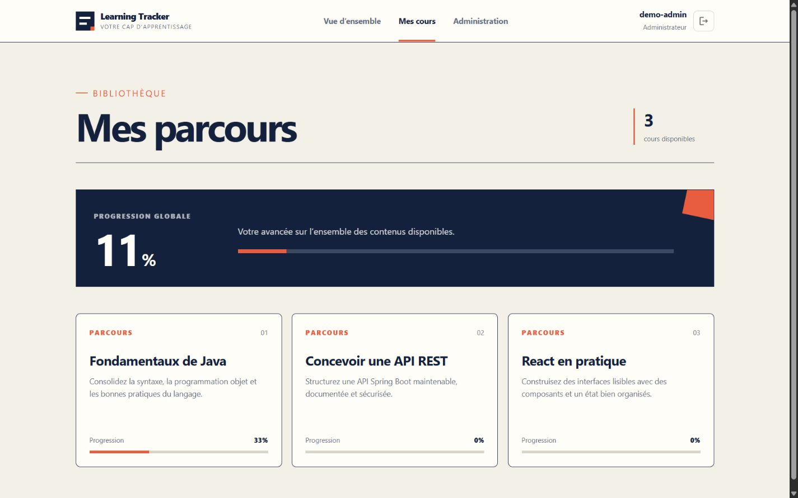
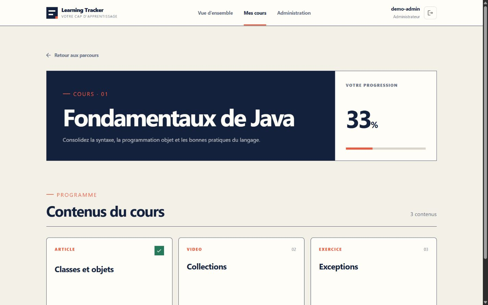
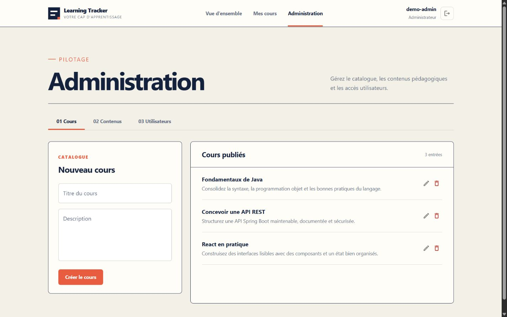

# Learning Tracker

[](https://github.com/Maxwell49000/Learning-tracker/actions/workflows/ci.yml)

Application full-stack de gestion de cours et de suivi de progression. Learning Tracker propose un espace clair pour parcourir des contenus pédagogiques, suivre son avancement et administrer un catalogue de formation.

## Aperçu



| Détail d’un cours | Administration |
| --- | --- |
|  |  |

L’interface possède une identité éditoriale responsive, construite autour d’une palette ivoire, bleu encre et vermillon. Une [galerie complète](docs/screenshots) est disponible dans la documentation.

## Fonctionnalités

- authentification stateless par JWT avec rôles `USER` et `ADMIN` ;
- catalogue de cours et de contenus pédagogiques ;
- progression globale, par cours et par contenu ;
- reprise visuelle des contenus déjà terminés ;
- administration des cours, contenus et utilisateurs ;
- routes privées côté React et autorisations vérifiées côté API ;
- documentation OpenAPI / Swagger ;
- données de démonstration reproductibles avec Docker Compose ;
- intégration continue pour les tests, le lint et le build.

## Stack technique

| Couche | Technologies |
| --- | --- |
| Frontend | React 19, Vite, Redux Toolkit, Material UI, Axios |
| Backend | Java 21, Spring Boot 4, Spring Security, Spring Data JPA |
| Données | MySQL 8.4, H2 pour les tests |
| Infrastructure | Docker Compose, Nginx, images multi-stage |
| Qualité | JUnit 5, ESLint, GitHub Actions |

## Démarrage rapide avec Docker

Prérequis : Docker Desktop avec Docker Compose.

```bash
cp .env.example .env
docker compose up --build
```

Sous PowerShell :

```powershell
Copy-Item .env.example .env
docker compose up --build
```

Ouvrez ensuite [http://localhost:3000](http://localhost:3000).

Le mode Docker initialise trois cours et un compte administrateur de démonstration :

```text
Utilisateur : demo-admin
Mot de passe : demo-password
```

Ces identifiants sont uniquement destinés à une démonstration locale. Remplacez les secrets de `.env` avant tout déploiement public.

Pour arrêter l’application sans supprimer les données :

```bash
docker compose down
```

La commande `docker compose down -v` supprime également le volume MySQL.

## Développement local

Prérequis : Java 21, Node.js 22+, npm et MySQL 8+.

1. Créez une base `learningtracker`.
2. Configurez `DATABASE_URL`, `DATABASE_USERNAME`, `DATABASE_PASSWORD` et `JWT_SECRET`.
3. Lancez l’API :

```bash
./mvnw spring-boot:run
```

Sous Windows :

```powershell
.\mvnw.cmd spring-boot:run
```

4. Lancez le frontend dans un second terminal :

```bash
cd frontend
npm ci
npm run dev
```

Vite sert l’interface sur `http://localhost:5173` et relaie `/api` vers Spring Boot sur le port `8080`.

## Tests et qualité

Backend :

```bash
./mvnw test
```

Frontend :

```bash
cd frontend
npm run lint
npm run build
```

La CI exécute automatiquement ces contrôles à chaque push sur `main` et pour chaque pull request.

## API et documentation

Lorsque l’API est lancée, Swagger UI est disponible sur :

```text
http://localhost:8080/swagger-ui/index.html
```

Pour aller plus loin :

- [Architecture technique](docs/ARCHITECTURE.md)
- [Documentation du frontend](frontend/README.md)
- [Variables d’environnement](.env.example)

## Sécurité de la démonstration

- les mots de passe sont stockés sous forme de hash BCrypt ;
- l’API ne conserve aucune session serveur ;
- les routes d’administration exigent le rôle `ADMIN` ;
- une inscription publique crée toujours un utilisateur standard ;
- les secrets réels et le fichier `.env` ne sont pas suivis par Git.
