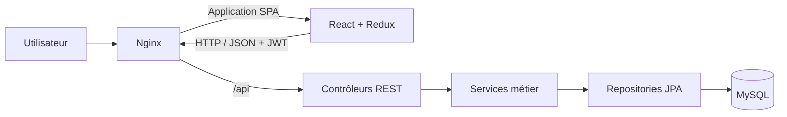
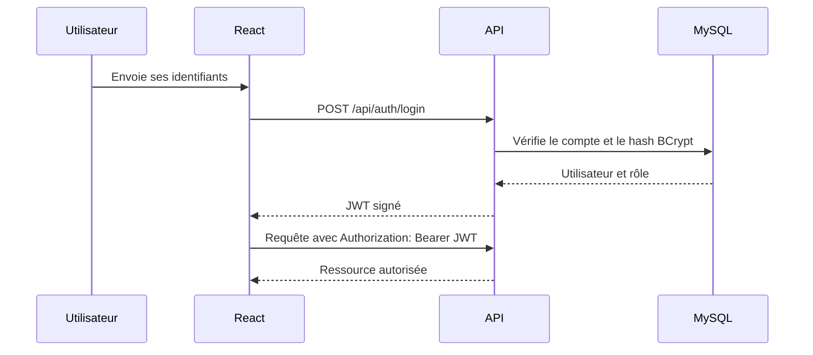
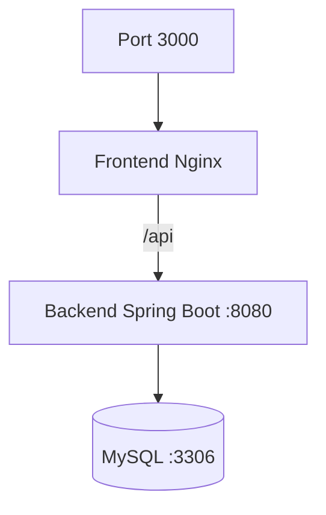

# Architecture technique

Learning Tracker utilise une architecture en couches, avec une séparation nette entre l’interface React, l’API Spring Boot et la persistance MySQL.

## Vue d’ensemble



En développement, Vite remplace Nginx et relaie `/api` vers Spring Boot. En production Docker, Nginx sert le build React, applique le fallback de la SPA et transmet les appels API au conteneur backend.

## Backend

Le backend suit le flux `Controller → Service → Repository` :

- `controllers` définit les contrats HTTP et renvoie les DTO ;
- `services` porte les règles métier et les calculs de progression ;
- `repositories` isole l’accès aux données avec Spring Data JPA ;
- `models` représente les entités persistées ;
- `dtos` contrôle les données exposées par l’API ;
- `security` configure Spring Security, le filtre JWT et les rôles ;
- `config` initialise les données de démonstration lorsque les variables associées sont présentes.

Les tests d’intégration utilisent H2 en mémoire et couvrent notamment l’authentification, les droits administrateur, les contenus et les calculs de progression.

## Frontend

```text
frontend/src
├── app/          configuration Redux et thème visuel
├── components/   composants partagés et protections de routes
├── features/     slices et sélecteurs Redux par domaine
├── hooks/        logique React réutilisable
├── pages/        écrans associés aux routes
├── routes/       définition du routeur
└── services/     accès à l’API avec Axios
```

Redux Toolkit conserve l’état d’authentification et le catalogue. Les services Axios centralisent les appels HTTP et ajoutent le JWT à l’en-tête `Authorization`.

L’identité visuelle repose sur des tokens Material UI centralisés dans `app/theme.js`, complétés par quelques primitives CSS globales. Les grilles et changements de structure sont responsive sans dupliquer les écrans.

## Authentification et autorisation



Le backend reste stateless. Chaque requête protégée transporte son JWT. Les composants `RequireAuth` et `RequireAdmin` améliorent la navigation côté client, mais les contrôles d’autorisation définitifs restent appliqués par Spring Security.

## Modèle de données

- un `Cours` possède plusieurs `Contenu` ;
- un `Utilisateur` possède une progression par contenu ;
- `ProgressionContenu` associe un utilisateur et un contenu avec son statut ;
- la progression d’un cours et la progression globale sont calculées à partir des contenus terminés.

## Conteneurs Docker



- `frontend` : build Vite multi-stage puis service statique Nginx ;
- `backend` : build Maven multi-stage puis runtime Java 21 ;
- `database` : MySQL 8.4 avec volume persistant et healthcheck.

Seul le frontend est exposé sur la machine hôte. Les échanges avec l’API et MySQL passent par le réseau interne Docker Compose.

## Intégration continue

Le workflow GitHub Actions contient deux jobs indépendants :

1. `backend` installe Java 21 et exécute les tests Maven ;
2. `frontend` installe Node.js 22, exécute ESLint puis produit le build Vite.

Le workflow est déclenché sur les pushes vers `main` et sur les pull requests.
